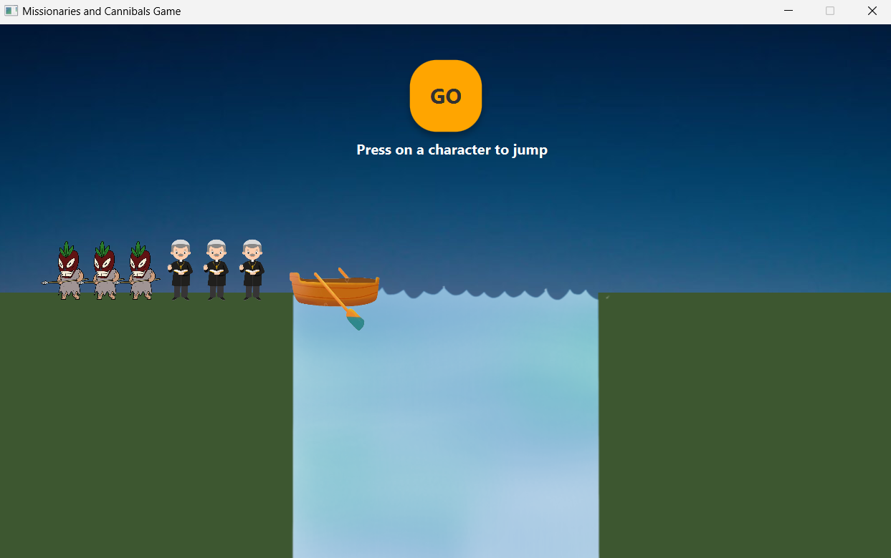
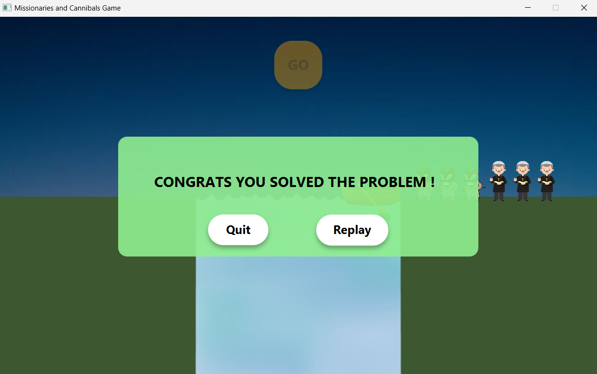
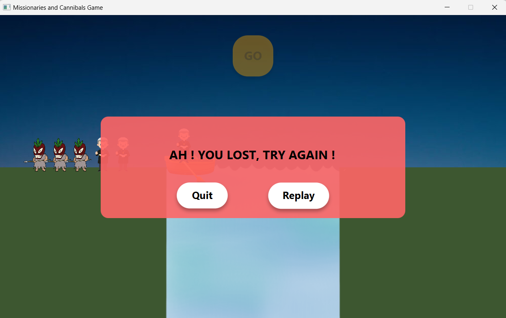

# CannibalsMissionairies Game

A simple Java-based implementation of the classic Cannibals and Missionaries puzzle game. 

***

> Table of Contents
1. Overview
2. Installation
3. Usage
4. Screenshots
5. Technologies Used
6. Contributing
7. Contact

***

## Overview
The Cannibals and Missionaries Game is a Java-based puzzle game where you must safely transport all missionaries and cannibals across a river using a boat, without ever leaving a group of missionaries outnumbered by cannibals on either side. The game uses AGR, a general search algorithm, to determine the optimal sequence of moves.

## Installation
To set up the project locally, follow these steps:

  1. Clone the Repository:
  ```
  git clone https://github.com/yourusername/CannibalsMissionariesGame.git
  ```

  2. Ensure you have Java and JavaFX installed on your system:     

  3. Compile the Java files:
  ```
  javac -cp . --module-path /path/to/javafx-sdk/lib --add-modules javafx.controls *.java
  ```

## Usage
  1. Run the game:
  ```
  java -cp . --module-path /path/to/javafx-sdk/lib --add-modules javafx.controls Main
  ```

  2. Use the graphical user interface to move the characters across the river by selecting them and clicking the "GO" button

## Screenshots 
Here are some screenshots of CannibalsMissionairiesGame project:

### Game Start


### Success


### Failure 


## Technologies Used
<div style="display: flex; gap: 20px; flex-wrap: wrap;">

* <div style="background-color:blue;color:white;border-radius:5px;padding:10px;margin:5px;">
     Java
  </div>

* <div style="background-color:#ffffff;color:#000000;border-radius:5px;padding:10px;margin:5px;">
     JavaFx
  </div>

</div>

## Contributing
Contributions to CannibalsMissionairiesGame are welcome! To contribute:

  1. Fork the repository.
  2. Create a new branch 

  ```
  git checkout -b feature-branch
  ```
  3. Make your changes.
  4. Commit your changes

  ```
  git commit -am "Add new feature"
  ```
  5. Push to the branch
  ```
  git push origin feature-branch
  ```
  6. Create a new Pull Request.

## Contact
For any inquiries or issues, feel free to reach out:

Name: Mohamed Akram Nsir    
Email: akramnsir5@gamil.com    
GitHub: https://github.com/AkramNsir
